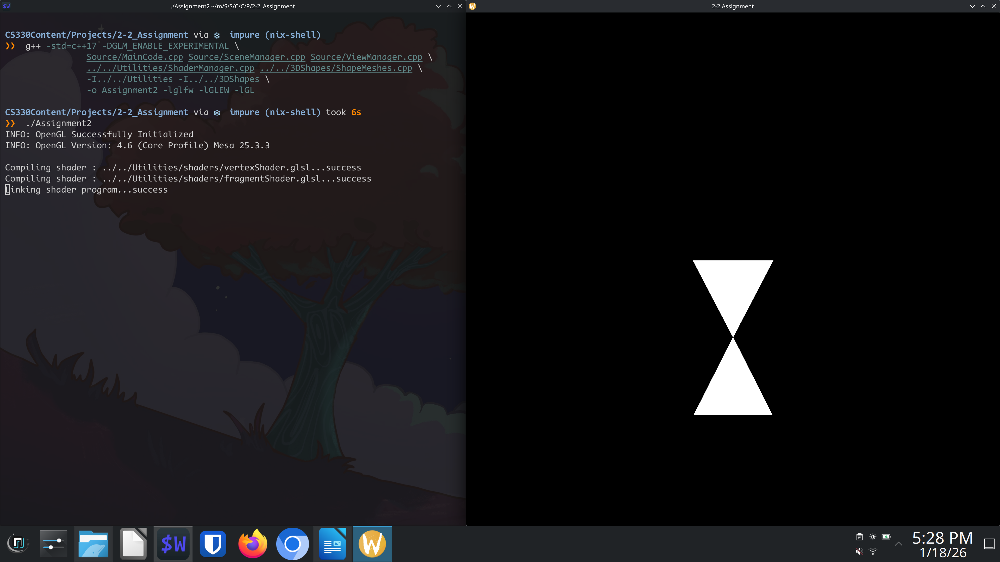
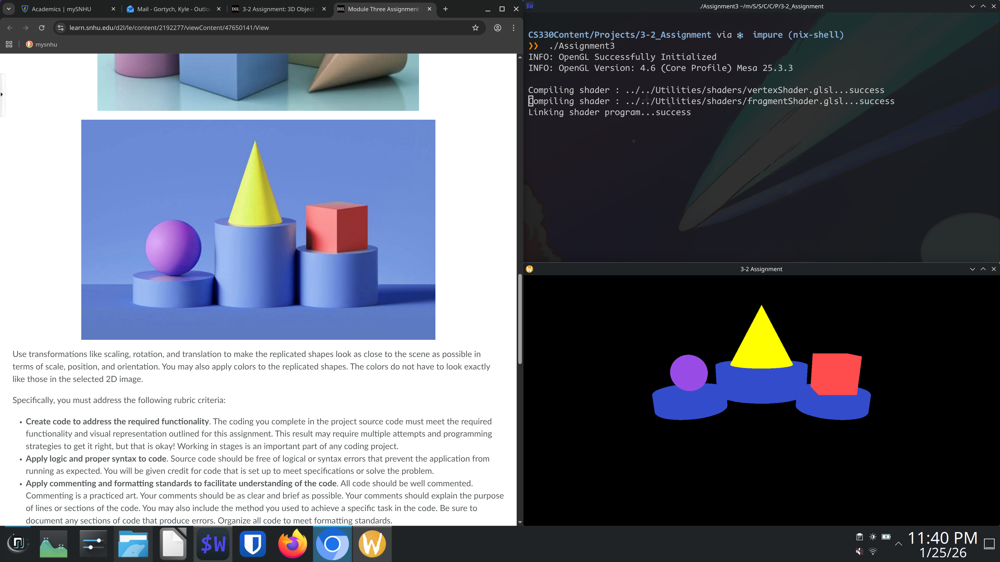
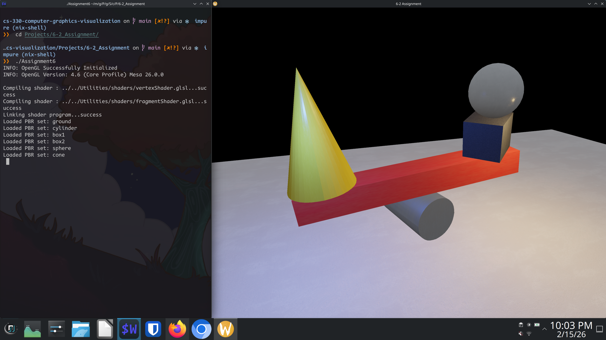

<div align="right">
 


</div>

# cs-330-computer-graphics-visualization
Project work from computer graphic and visualization

note to use for prefromance 
Deferred Shading + PBR + Normal Mapping + Shadow Mapping

## About
This is an example of using c++ and OpenGL to make scenes and show case the use of .

## Motivation
To show the work done in CS 330 computer graphics and visualization SNHU.

## Getting Started
Setup is done via `git clone url`.

Then the git submodules need to be initialised
`cd ./Libraries`
`git submodule update --init --recursive`

## Installation

### Tools
Installation best via a system level package manager or ephemeral build environment.
Transitvie dependecies such as language are shown via tree level.

- git
- make
- clang or gcc
    - C++ 17+
- OpenGL 3.3+

#### External Libraries

- git submodules
    - GLFW
    - GLEW
    - glm

- included source
    - glad

## Reflection

### 1. How do I approach designing software?
- What new design skills has your work on the project helped you to craft?
    - The design skill I've learned to use that has helped me is to first think of the structure of the project. By knowing the directory layout and global and local files it helps in understanding what each part is doing.

- What design process did you follow for your project work?
    - The design process I followed for the projects is to keep a modular layout and ensure each project could use the global files such as the shader files.

- How could tactics from your design approach be applied in future work?
    - In the future I can use make files to manage building multiple executables.

### 2. How do I approach developing programs?
- What new development strategies did you use while working on your 3D scene?
    - I haved learned the structure of OpenGL and the use of global vs local classes and header files.

- How did iteration factor into your development?
    - The biggest iteration came from moving objects and seeing the effect diffrent changes I made to the code had. 

- How has your approach to developing code evolved throughout the milestones, which led you to the project’s completion?
    - Yes, my approach has changed in that instead of trying to implement right away is to first see what has already been implemented and what needs to change from previous work. There is alot of features that each projects needs and reimplementin each time would not be efficent and could cause confusion for maintainability. 

### 3. How can computer science help me in reaching my goals?
- How do computational graphics and visualizations give you new knowledge and skills that can be applied in your future educational pathway?
    - Knowing how to structure an OpenGL project and create visualizations can be useful in future projects that require multiple executables or binaries to be made. It also helps in terms of needing to make 3d objects or animations while limited to budget or deadline. 

- How do computational graphics and visualizations give you new knowledge and skills that can be applied in your future professional pathway?
    - The biggest benefit in learning OpenGL and using c++ for visualizations and graphics is it is applicable to many businesses workflows and products.

## Usage

### Code Examples

#### 1-2_OpenGLSample

<details>
<summary>Click to see</summary>

```c++

```

</details>

##### Screenshot

<details>
<summary>Click to see</summary>

<div align="center">
  
</div>

</details>

#### 2-2_Assignment

<details>
<summary>Click to see</summary>

```c++

```

</details>

##### Screenshot

<details>
<summary>Click to see</summary>

<div align="center">
  
</div>

</details>

#### 3-2_Assignment

<details>
<summary>Click to see</summary>

```c++

```

</details>

##### Screenshot

<details>
<summary>Click to see</summary>

<div align="center">
  
</div>

</details>

#### 4-2_Assignment

<details>
<summary>Click to see</summary>

```c++

```

</details>

##### Screenshot

<details>
<summary>Click to see</summary>

<div align="center">
  
</div>

</details>

#### 5-2_Assignment

<details>
<summary>Click to see</summary>

```c++

```

</details>

##### Screenshot

<details>
<summary>Click to see</summary>

<div align="center">
  
</div>

</details>

#### 6-2_Assignment

<details>
<summary>Click to see</summary>

```c++

```

</details>

##### Screenshot of Milestone

<details>
<summary>Click to see</summary>

<div align="center">
  
</div>

</details>

##### Screenshot of Assignment 6

<details>
<summary>Click to see</summary>

<div align="center">
  
</div>

</details>

#### 7-1_Assignment

<details>
<summary>Click to see</summary>

```c++

```

</details>

##### Screenshot

<details>
<summary>Click to see</summary>

<div align="center">
  
</div>

</details>

#### 8-2_Assignment

<details>
<summary>Click to see</summary>

```c++

```

</details>

##### Screenshot

<details>
<summary>Click to see</summary>

<div align="center">
  
</div>

</details>

### Tests

#### blank

<details>
<summary>Click to see</summary>

```blank

```

</details>
